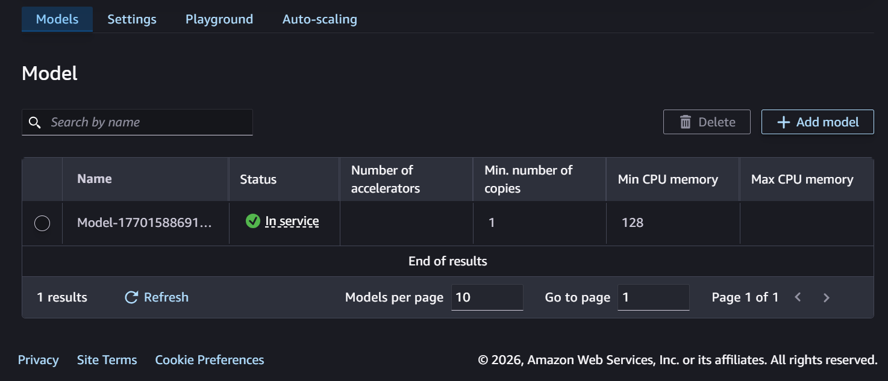
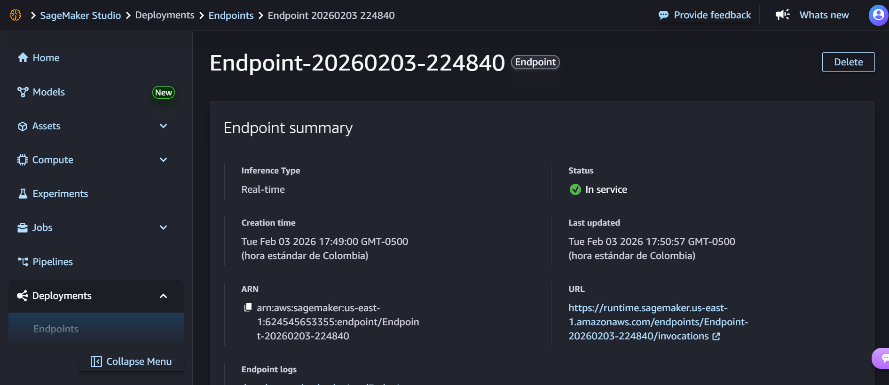
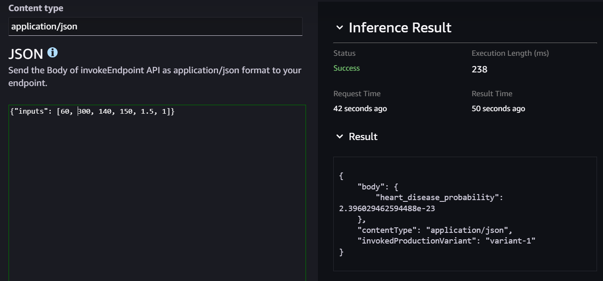

# Heart Disease Risk Prediction using Logistic Regression

## Exercise Summary 

This project implements logistic regression from scratch to predict the presence of heart disease using clinical data.
The notebook covers the full machine learning workflow:

- Exploratory Data Analysis (EDA)
- Data preprocessing and normalization
- Logistic regression implementation (without scikit-learn)
- Model training and evaluation
- Decision boundary visualization
- L2 regularization analysis
- Deployment exploration using Amazon SageMaker

The goal is to demonstrate both theoretical understanding and practical application of logistic regression in a real-world healthcare context.
## Dataset Description

- Source: Kaggle – Heart Disease Dataset
https://www.kaggle.com/datasets/neurocipher/heartdisease
- Records: 303 patients
- Target variable:
    - 1 → Presence of heart disease
    - 0 → Absence of heart disease
- Disease prevalence: ~55%

## Selected Features

At least 6 numerical features were used, including:

- Age (years)
- Resting blood pressure (mm Hg)
- Serum cholesterol (mg/dL)
- Maximum heart rate achieved
- ST depression induced by exercise
- Number of major vessels (0–3)

Ranges example:

- Age: 29–77 years
- Cholesterol: 112–564 mg/dL

## Exploratory Data Analysis (EDA)

- Summary statistics and distributions were analyzed
- No critical missing values found
- Class distribution visualization confirmed moderate imbalance
- Features were normalized using standard scaling
- Data split: 70% training / 30% testing, stratified by class

## Deployment Evidence (Amazon SageMaker)

Proceso resumido
- Exported `weights.npy` and `bias.npy`
- Packaged as `model.tar.gz`
- Created endpoint in SageMaker Studio
- Deployed and tested with sample input

Sample inference
Input: `Age=60, Chol=300, RestingBP=140, MaxHR=150, ST_Depression=1.5, Vessels=1`  
Output: `Probability=2.39`  

Endpoint ARN
`arn:aws:sagemaker:us-east-1:624545653355:endpoint/Endpoint-20260203-224840`

### Screenshots
  
  

  

